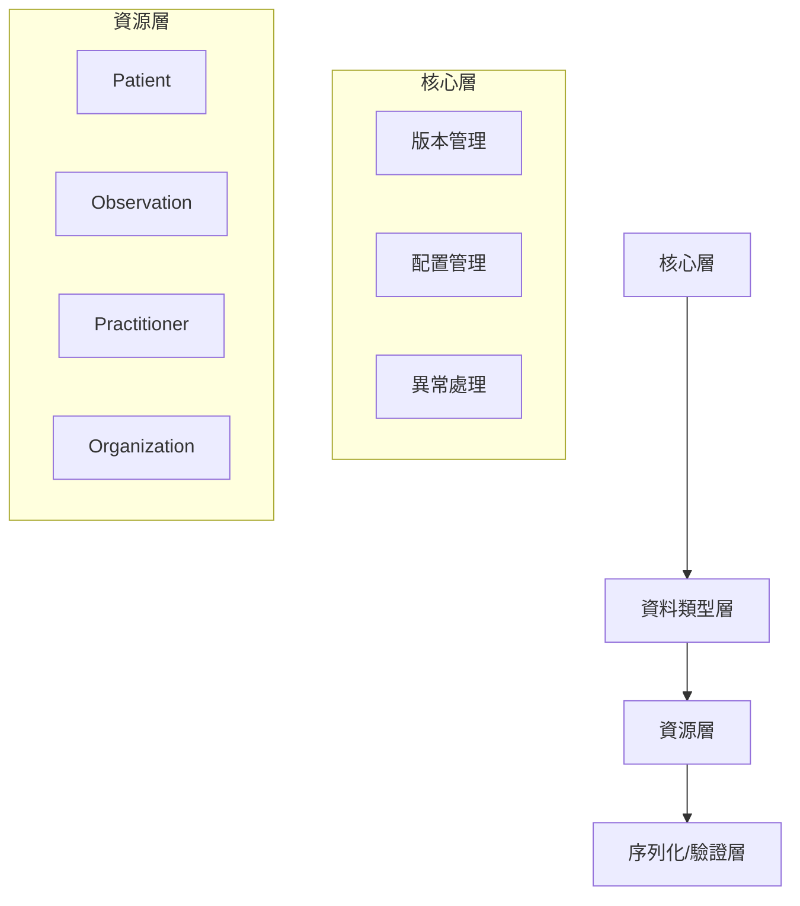

# FHIR SDK 完整使用手冊

## 目錄
1. [概述](#概述)
2. [架構深度解析](#架構深度解析)
3. [核心功能](#核心功能)
4. [版本遷移](#版本遷移)
5. [擴展開發](#擴展開發)
6. [故障排除](#故障排除)

---

## 概述

FHIR SDK 是一個企業級的.NET FHIR實現，專為需要高性能、可擴展和版本兼容的應用程式而設計。本手冊涵蓋了所有高級功能和最佳實踐。

### 核心價值主張
- **類型安全**：強型別C#類別對應所有FHIR資源。
- **高性能序列化**：在強型別物件與 JSON/XML 之間進行高效能轉換。
- **內建驗證**：資源本身具備驗證能力，確保資料合規性。
- **版本管理**：內建R5到R6的遷移路徑。

---

## 架構深度解析

### 分層架構



### 關鍵組件

#### 1. 版本管理系統
所有核心組件都實現了 `IVersionAware` 介面，允許在執行時期處理不同版本的 FHIR 資源。

```csharp
public interface IVersionAware
{
    FhirVersion SupportedVersion { get; }
}
```

#### 2. 序列化器
SDK 提供了高效的 JSON 和 XML 序列化器，可以輕鬆地在強型別物件和字串之間進行轉換。

```csharp
// 將 Patient 物件序列化為 JSON 字串
var patient = new Patient { Id = "123" };
var json = new FhirJsonSerializer().SerializeToString(patient);

// 將 XML 字串反序列化為 Observation 物件
var xml = "<Observation><id value=\"456\"/></Observation>";
var observation = new FhirXmlParser().Parse<Observation>(xml);
```

---

## 核心功能

### 資源的建立與操作
您可以像操作普通 C# 物件一樣建立和修改 FHIR 資源。

```csharp
        var patient = new Patient
        {
            Id = Guid.NewGuid().ToString(),
    Active = true,
    Name = new List<HumanName>
    {
        new HumanName
        {
            Use = HumanName.NameUse.Official,
            Family = "陳",
            Given = new List<string> { "大文" }
        }
    },
    BirthDateElement = new Date(1990, 1, 1)
};

patient.Gender = AdministrativeGender.Male;
```

### 內建驗證
所有 FHIR 資源物件都內建了 `Validate()` 方法，可以根據 FHIR 規範驗證其內容。

```csharp
var validationResult = patient.Validate();

if (!validationResult.IsValid)
{
    foreach (var issue in validationResult.Issues)
    {
        Console.WriteLine($"驗證錯誤: {issue.Details} at {issue.Location}");
    }
}
```

---

## 版本遷移

### 自定義遷移器實現
您可以實現自己的遷移器，處理不同版本之間的資源轉換邏輯。

```csharp
public class CustomR5ToR6Migrator : BaseFhirMigrator
{
    public override FhirVersion FromVersion => FhirVersion.R5;
    public override FhirVersion ToVersion => FhirVersion.R6;
    
    protected override JsonDocument MigrateInternal(JsonDocument source)
    {
        var root = source.RootElement;
        // ... 在此實現您的轉換邏輯 ...
        return ConvertPatient(root);
    }
}
```

---

## 擴展開發

### 自定義資源類型
您可以透過繼承現有的資源類型來建立自己的擴充資源。

```csharp
[ResourceType("CustomPatient")]
public class CustomPatient : Patient
{
    [Element("customField", Order = 10)]
    [FhirElement("customField", InSummary = true)]
    public FhirString CustomField { get; set; }

    public override IDeepCopyable DeepCopy()
    {
        var dest = new CustomPatient();
        base.CopyTo(dest);
        if (CustomField != null) dest.CustomField = (FhirString)CustomField.DeepCopy();
        return dest;
    }
}
```

### 自定義驗證器
您可以實現自己的驗證器，加入客製化的業務規則驗證。

```csharp
public class CustomFhirValidator : IFhirValidator
{
    public async Task<IValidationResult> ValidateResourceAsync<T>(T resource) where T : IFhirResource
    {
        var issues = new List<IValidationIssue>();
        // ... 在此實現您的驗證邏輯 ...
        return new ValidationResult { IsValid = !issues.Any(), Issues = issues };
    }
}
```

---

## 故障排除

### 常見問題及解決方案

#### 1. 序列化/反序列化錯誤
**問題**: `Deserialization failed: Unexpected token when parsing...`
**解決方案**:
- 檢查來源的 JSON/XML 格式是否正確。
- 確保 `resourceType` 屬性與您要反序列化的 C# 類型匹配。

#### 2. 驗證失敗
**問題**: `Validate()` 回傳 `IsValid = false`。
**解決方案**:
- 仔細檢查 `validationResult.Issues` 中的詳細資訊，它會指出哪個欄位不符合規範。
- 對照 FHIR 官方文件，確認欄位的基數 (Cardinality) 和資料類型是否正確。
