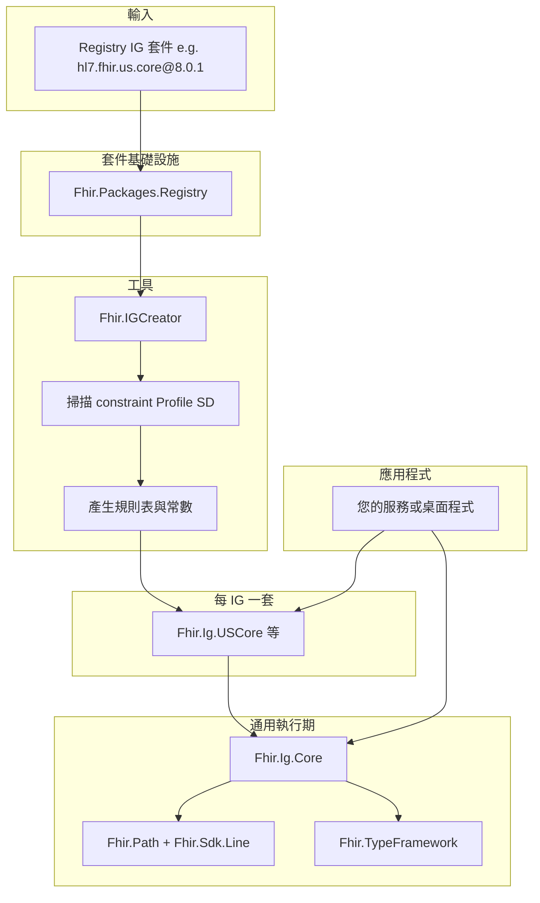
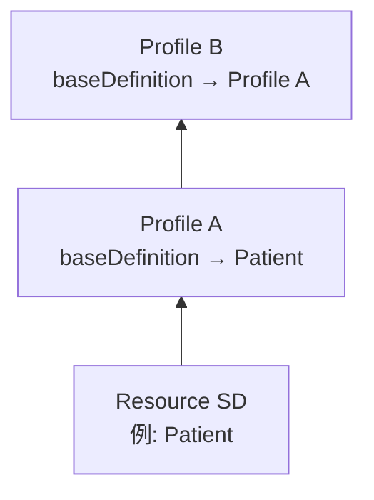

# FHIR IG SDK 整體架構

> **執行期 Profile 驗證**在本 SDK 的 **`Fhir.Validation`**（由 `Fhir.Sdk.{Line}` 帶入）。IG 產生器（每 IG 一個 NuGet）仍可位於應用層儲庫 **[FHIR.Solutions](https://github.com/sjvann/FHIR.Solutions)**。本頁說明邊界。

## 目標

在既有 **TypeFramework / Sdk / FHIRPath / Terminology** 之上，提供以 **Implementation Guide（IG）與 Profile** 為中心的應用層能力：

- 由 Registry 套件（如 `hl7.fhir.us.core`）產生 **每 IG 一個** NuGet（`Fhir.Ig.{ShortName}`）。
- 透過 **`Fhir.Validation`** 對已 Parse 的 POCO + StructureDefinition snapshot 做 cardinality、type、binding 政策、slicing、FHIRPath invariant。Terminology Server **不**在本庫（`ITerminologyService` 可外接）。
- 應用程式僅需引用對應 IG 套件（例如 `Fhir.Ig.USCore`），即可取得 Profile URL 常數、規則表與 DI 註冊。

本層**不是** FHIR Server；REST `$validate`、儲存前驗證等屬後續 Phase 3。

## 方案內角色關係



## 與 ResourceCreator 的差異

| 項目 | Fhir.ResourceCreator | Fhir.IGCreator |
|------|----------------------|----------------|
| 輸入 SD | `kind = resource`（核心資源） | `derivation = constraint`（Profile） |
| 產出 | `Fhir.Resources.{Line}` POCO | `Fhir.Ig.{ShortName}` 規則表與常數 |
| 對外 NuGet | 資源組件 | IG 組件 + `Fhir.Ig.Core` |
| 相依 Sdk | 內含於資源組件鏈 | 引用對應線別 `Fhir.Sdk.{Line}` |

ResourceCreator 與 IGCreator **共用** `Fhir.Packages.Registry` 下載／解壓邏輯。

## 通用 vs 每 IG 專用

| 層級 | 專案 | 職責 |
|------|------|------|
| **通用執行期** | `Fhir.Validation` | `IProfileValidator`、ProfileCatalog、binding 政策、slicing、FHIRPath invariant、`ITerminologyService` |
| **每 IG（可選，Solutions）** | `Fhir.Ig.{ShortName}` | Profile URL 常數、規則表、DI |
| **線別入口** | `Fhir.Sdk.{Line}` | POCO、FHIRPath、Parse／Serialize、`CreateValidator` |

「專用」指的是 **每個已 install 的 IG 各產生一個套件**，不是 US Core 專屬架構；`hl7.fhir.uv.ips` 會產生 `Fhir.Ig.UvIps` 等。

## Profile 繼承（兩層）

### 1. IG 套件相依（package 層）

`package.json` 的 `dependencies` 可指向其他 IG。`install` 時會遞迴下載相依套件；產生時以 **使用者指定的 root package** 為單位產出一個 `Fhir.Ig.{ShortName}`，並將相依套件內符合條件的 StructureDefinition 納入 catalog。

### 2. Profile 繼承（StructureDefinition 層）



- Profile 以 **`baseDefinition`** 指向父層（核心 Resource 或另一 Profile）。
- 驗證宣告 **Profile B** 時，沿鏈套用規則（子 Profile snapshot 已展開時以目標 Profile 為主，否則依序合併祖先規則）。
- `meta.profile` 若同時宣告多個 URL，依繼承鏈取 **最特定** 子 Profile。

## 驗證管線（執行期）

1. 解析 `meta.profile`（與 IG catalog 交集；多個宣告時取最特定）。
2. **Cardinality**（FHIRPath 計數元素）。
3. **fixed / pattern**（與 SD 固定值比對）。
4. **Binding**（記憶體登錄表；完整 ValueSet 成員檢查可接 Terminology）。
5. **FHIRPath constraint**（`IFhirPathConstraintRunner`；複雜 `%resource` 等仍可能為 Warning）。
6. Slicing／完整外部 Validator：後續 Phase 2。

## 產生物理位置

預設：

```
Fhir.IGCreator/generated/
  Fhir.Ig.USCore/           # 主套件
  Fhir.Ig.USCore.Tests/     # 與主套件同層（非子資料夾）
```

套件快取（與 ResourceCreator 可共用）：

```
artifacts/fhir-packages/{package-id}/{version}/
```

## 延伸閱讀

- [IG SDK 使用手冊](user-manual.md)
- [IG 命名與發佈](naming.md)
- [資源產生架構](../../concepts/resource-generation.md)
- 儲存庫根目錄 `AGENTS.md`
