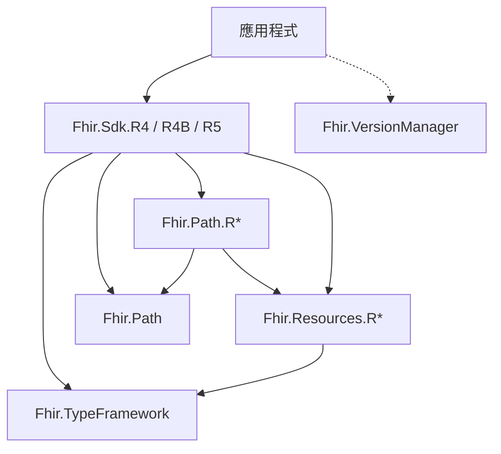

# 套件分層

方案裡會看到 **Path** 與 **Sdk** 兩群，各有 R4／R4B／R5。這是為了讓三條 FHIR 線別並存、互不混型，不是要應用開發者三套都裝。

## 誰該引用什麼

**應用只引用 `Fhir.Sdk.{Line}`。** Path 與 Resources 是實作細節，會隨入口套件帶入。

## 各層職責

| 層 | 專案 | 來源 | 發佈 |
|----|------|------|------|
| 共用基底 | `Fhir.TypeFramework`、`Fhir.TypeFramework.Interop` | 手寫 | 是 |
| FHIRPath 引擎 | `Fhir.Path` | 手寫 | 是 |
| 線別 Path 門面 | `Fhir.Path.R4`／`R4B`／`R5` | ResourceCreator scaffold | 一般不單獨引用 |
| 資源 POCO | `Fhir.Resources.R4`／`R4B`／`R5` | ResourceCreator 自 StructureDefinition **產生** | 是（由 Sdk 帶入） |
| 線別入口 | `Fhir.Sdk.R4`／`R4B`／`R5` | ResourceCreator scaffold | **對外唯一入口** |
| 線別偵測 | `Fhir.VersionManager` | 手寫 | 是 |
| 產生器 | `Fhir.ResourceCreator` | 手寫工具 | 否 |

## ResourceCreator 做了什麼

兩件事，重量差很多：

1. **主產物**：從 FHIR Package Registry 解析 StructureDefinition，產生 `Fhir.Resources.{Line}` 強型別 POCO。
2. **Scaffold**：依 R5 模板寫出薄殼的 `Fhir.Path.{Line}` 與 `Fhir.Sdk.{Line}`（門面、`.csproj`、DI）。可用 `--scaffold-fhir-lines` 單獨重跑。

`Fhir.Path`（無版次後綴）與 TypeFramework **不是**產生器產出，而是手寫共用程式碼。

## 為何看起來像「兩大群組 × 三個版次」

- **Path**：FHIRPath 求值；核心引擎一份，每條線別一個門面（對齊該線別資源型別）。
- **Sdk**：給應用的單一 NuGet，把該線別需要的一切捆在一起。

維護本 SDK 時才需要跑 ResourceCreator（重新產生資源或新增 R6）。應用開發者選對 `Fhir.Sdk.*` 即可。

## 延伸閱讀

- [開始使用](../getting-started/index.md)
- [資源產生管線](resource-generation.md)
- [多線別開發體驗](multi-version.md)
