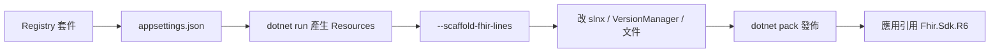

# 新增或升級 FHIR 線別

HL7 發布**新大版本**（例如 R6）或**既有核心套件新版**時，由 SDK 維護者用 `Fhir.ResourceCreator` 產生資源，再接到現有 Path／Sdk／VersionManager。應用／前端開發者**不必**跑產生器，等套件發佈後改引用對應的 `Fhir.Sdk.{Line}`。

本頁以 **R6** 為例；換成其他線別時把 `R6`、`hl7.fhir.r6.core`、版本號一併替換即可。



## 1. 要取得什麼

輸入是 FHIR Package Registry 的 **NPM 風格 `.tgz`**（`hl7.fhir.r{n}.core`），不是 Excel，也不是 NuGet 規格套件。

| 要取得的東西 | 哪裡找 | 用途 |
|--------------|--------|------|
| 核心套件 **id + 版本** | [packages.fhir.org](https://packages.fhir.org) 搜尋 `hl7.fhir.r6.core`（或該線別的 `hl7.fhir.r{n}.core`） | 寫進 `appsettings.json` 的 `Packages[]` |
| 套件內 **StructureDefinition** | 產生器會自動下載並解壓；優先讀 `snapshot.element` | 產生 `Patient` 等 POCO |
| 規格上的**新資料型別** | 該版 [HL7 FHIR 規格](https://hl7.org/fhir) 的 Datatypes | 判斷 TypeFramework 缺什麼（建置失敗時才補） |
| （選用）官方資源清單 | 同套件內 `kind = resource` 的 SD | 決定要不要設 `ResourcesInclude` |

查版本範例（瀏覽器或 HTTP）：

```
https://packages.fhir.org/hl7.fhir.r5.core
https://packages.fhir.org/hl7.fhir.r4.core
https://packages.fhir.org/hl7.fhir.r4b.core
```

目前已接線的對照：

| 線別 | Registry `PackageId` | 本庫使用的 `Version` | 產出專案 |
|------|----------------------|----------------------|----------|
| R4 | `hl7.fhir.r4.core` | `4.0.1` | `Fhir.Resources.R4`（可由 id 推斷） |
| R4B | `hl7.fhir.r4b.core` | `4.3.0` | 須明示 `Fhir.Resources.R4B`（否則會推成 `R4b`） |
| R5 | `hl7.fhir.r5.core` | `5.0.0` | `Fhir.Resources.R5` |

`hl7.fhir.r6.core` 會推斷為 `Fhir.Resources.R6`。含 `b` 這類後綴的 id（如 `r4b`）請**手動**設 `OutputProjectName`／`RootNamespace`。

產生器**不會**要你另存一份 SD JSON；連得上 Registry 即可。離線時把已下載的 `.tgz` 解到 `artifacts/fhir-packages/{package-id}/{version}/` 也可（目錄慣例與 [資源產生架構](../concepts/resource-generation.md) 相同）。

## 2. 要下什麼指令

在儲存庫根目錄操作。相對路徑（`OutputRoot`、快取）以 **`Fhir.ResourceCreator` 為工作目錄** 時最穩。

### 2.1 登記套件

編輯 `Fhir.ResourceCreator/appsettings.json` 的 `Generator.Packages`，新增一筆（或改既有線別的 `Version`）：

```json
{
  "PackageId": "hl7.fhir.r6.core",
  "Version": "6.0.0",
  "OutputProjectName": "Fhir.Resources.R6",
  "RootNamespace": "Fhir.Resources.R6"
}
```

- 第一次接新線別：建議**先不要**設 `ResourcesInclude`（或設 `[]`），讓套件內符合條件的 resource SD 全產，較容易對照規格。
- 只升級既有線別版本：改該筆的 `Version`，產出會覆寫 `generated/Fhir.Resources.{Line}/`。

完整鍵值見 [設定參考](../reference/configuration.md)。

### 2.2 產生資源 POCO

```powershell
cd Fhir.ResourceCreator
dotnet run -c Release
```

成功時出現 `Fhir.ResourceCreator finished.`

預期目錄：

```
Fhir.ResourceCreator/generated/Fhir.Resources.R6/
  Fhir.Resources.R6.csproj
  Patient.cs
  ...
  Fhir.Resources.R6.Tests/
```

若建置抱怨缺少複合型別，先在 **`Fhir.TypeFramework`** 補齊該版新 datatype，再重跑同一指令。不要為 R6 再拆一份 TypeFramework。

### 2.3 Scaffold Path 與 Sdk 門面

產生器**不會**自動改方案檔。資源出來後另跑：

```powershell
# 於儲存庫根目錄
dotnet run --project Fhir.ResourceCreator -- --scaffold-fhir-lines
```

這會依 `generated/Fhir.Resources.*` 寫出（或覆寫）薄殼：

- `Fhir.Path.R6/`（門面、DI、x-query；**Patch 僅 R5 模板有**，其他線別不產生 Patch）
- `Fhir.Sdk.R6/`（對外入口、`AddFhirSdkR6`）

只重產既有 R4／R4B／R5 資源、門面已存在時，仍可跑此指令對齊 `.csproj` 與 DI。

### 2.4 驗證產生結果

```powershell
dotnet build Fhir.ResourceCreator/generated/Fhir.Resources.R6/Fhir.Resources.R6.csproj
dotnet test  Fhir.ResourceCreator/generated/Fhir.Resources.R6/Fhir.Resources.R6.Tests/Fhir.Resources.R6.Tests.csproj
```

## 3. 完成後要改哪些地方才能融入架構

Scaffold **只寫 Path／Sdk 專案檔與門面**，下列必須手改，否則方案建置不到、多線別偵測不到、文件與 API 站也不會出現新線別。

### 3.1 必改：方案

`Fhir.Sdk.slnx` 加入四個專案（路徑比照 R5）：

```xml
<Project Path="Fhir.ResourceCreator/generated/Fhir.Resources.R6/Fhir.Resources.R6.csproj" />
<Project Path="Fhir.ResourceCreator/generated/Fhir.Resources.R6/Fhir.Resources.R6.Tests/Fhir.Resources.R6.Tests.csproj" />
<Project Path="Fhir.Path.R6/Fhir.Path.R6.csproj" />
<Project Path="Fhir.Sdk.R6/Fhir.Sdk.R6.csproj" />
```

然後：

```powershell
dotnet build Fhir.Sdk.slnx
dotnet test  Fhir.Sdk.slnx
```

### 3.2 必改：VersionManager（多線別才能「看見」新版）

應用若用 `AddFhirVersionManager()` 依 `/metadata` 或 URL 選線別，必須擴充：

| 檔案 | 要做的事 |
|------|----------|
| `Fhir.VersionManager/FhirVersion.cs` | 新增列舉值，例如 `R6 = 6` |
| `Fhir.VersionManager/FhirVersionParser.cs` | `ParseFromCapabilityString`（如 `6.`）、`ParseFromShortName`、`ToShortName` |
| `Fhir.VersionManager/FhirVersionDetector.cs` | `FromBaseUrl` 增加 `/r6`、`baseR6` 等線索 |
| `Fhir.VersionManager/Capability/CapabilityModelFactory.cs` | 比照 `FromR5`：反序列化 `Fhir.Resources.R6.CapabilityStatement` 並窄化 |
| `Fhir.VersionManager/Capability/FhirCapabilityRuntime.cs` | `deserializeVersion` 的 `switch` 增加 `FhirVersion.R6 => FromR6(...)`（勿只靠預設落到 R5） |
| `Fhir.VersionManager/Fhir.VersionManager.csproj` | `ProjectReference` 指向 `Fhir.Resources.R6` |
| `Fhir.VersionManager.Tests` | 補 `6.0.0`、`R6`、URL 案例 |

未改這層時，新套件仍可被**直接引用**，但「宣告／偵測線別」會落到 `Unknown` 或預設 R5。

### 3.3 視情況：TypeFramework

只在產生或建置失敗、錯誤為「找不到某 FHIR 資料型別」時擴充**同一** `Fhir.TypeFramework`，再重跑 §2.2。

### 3.4 文件與 DocFX

| 檔案 | 要做的事 |
|------|----------|
| `Fhir.Docs/getting-started/packages.md` | 表格加上 `Fhir.Sdk.R6` |
| `Fhir.Docs/guides/consume-sdk.md`、根目錄 `README.md` | 線別列舉補 R6 |
| `Fhir.Docs/docfx.json` 的 `metadata.src.files` | 加入 `Fhir.Path.R6`、`Fhir.Sdk.R6` |
| `.github/workflows/docs.yml` 的 `paths` | 同樣加上新資料夾，推送才會重編文件站 |

### 3.5 發佈 NuGet

於方案根目錄：

```powershell
dotnet pack Fhir.Sdk.slnx -c Release -o LocalNuget
```

應用要吃到的是 **`Fhir.Sdk.R6`**（會帶上 `Fhir.Resources.R6`、`Fhir.Path`、TypeFramework）。`Fhir.ResourceCreator` 與 `Fhir.Packages.Registry` **不發佈**。

正式來源是 **GitHub Packages**（`https://nuget.pkg.github.com/sjvann/index.json`）。本機 `LocalNuget` 只是打包暫存。推送 `v*` 標籤或手動跑 **Publish NuGet** workflow（`.github/workflows/publish-nuget.yml`）會測試、打包並 `nuget push`。同一 `PackageVersion` 不能覆寫；發新版先改各專案版本再打新標籤。

應用如何加來源與登入見 [在應用中使用 SDK](consume-sdk.md)。

## 4. 應用／前端如何引用新版本

維護者完成 §3 並發佈後，前端或服務專案**只改套件與 using**，不必碰 ResourceCreator。

**NuGet（建議）：**

```xml
<ItemGroup>
  <PackageReference Include="Fhir.Sdk.R6" Version="1.0.0" />
  <!-- 需要依伺服器偵測線別時再加 -->
  <PackageReference Include="Fhir.VersionManager" Version="1.0.0" />
</ItemGroup>
```

**同儲存庫開發：**

```xml
<ProjectReference Include="..\FHIR-SDK\Fhir.Sdk.R6\Fhir.Sdk.R6.csproj" />
```

**程式：**

```csharp
using Fhir.Resources.R6;
using Fhir.Sdk.R6;
using Fhir.Sdk.R6.DependencyInjection;

services.AddFhirSdkR6();

var patient = new Patient { /* ... */ };
var path = FhirSdkR6.CreatePath();
var values = path.Evaluate("name.family", patient);
```

Blazor／Avalonia 等 UI 與後端相同：引用 `Fhir.Sdk.R6`，不要直接引用 `Fhir.Path.R6` 或 `Fhir.Resources.R6`（除非你要避開入口套件）。

同一應用可同時引用 `Fhir.Sdk.R5` 與 `Fhir.Sdk.R6`，但 `Fhir.Resources.R5.Patient` 與 `Fhir.Resources.R6.Patient` **不能混用**。跨線別 UI 請走 [VersionManager](../concepts/multi-version.md)。

應用層（QueryBuilder、IG 驗證）若要支援新線別，在 **[FHIR.Solutions](https://github.com/sjvann/FHIR.Solutions)** 對該線別加上對應的 Sdk 參考與 DI；本庫只提供 `Fhir.Sdk.R6`。

## 只升級既有線別的套件版本

例如 `hl7.fhir.r5.core` `5.0.0` → 更新版：

1. 改 `appsettings.json` 該筆 `Version`。
2. 在 `Fhir.ResourceCreator` 目錄 `dotnet run -c Release`。
3. 建置／測試 `Fhir.Resources.R5`（與 `.Tests`）。
4. 通常**不必**重跑 scaffold，也不必新增 slnx 項目。
5. 提高 `Fhir.Resources.R5`／`Fhir.Sdk.R5` 的套件版本後 `dotnet pack`，應用更新 `PackageReference` 的 `Version`。

若新版 SD 引入 TypeFramework 尚未涵蓋的 datatype，仍須先補 TypeFramework。

## 延伸閱讀

- [ResourceCreator 使用手冊](resource-creator.md)
- [套件分層](../concepts/architecture.md)
- [命名與發佈](../reference/naming-and-packaging.md)
- [在應用中使用 SDK](consume-sdk.md)
