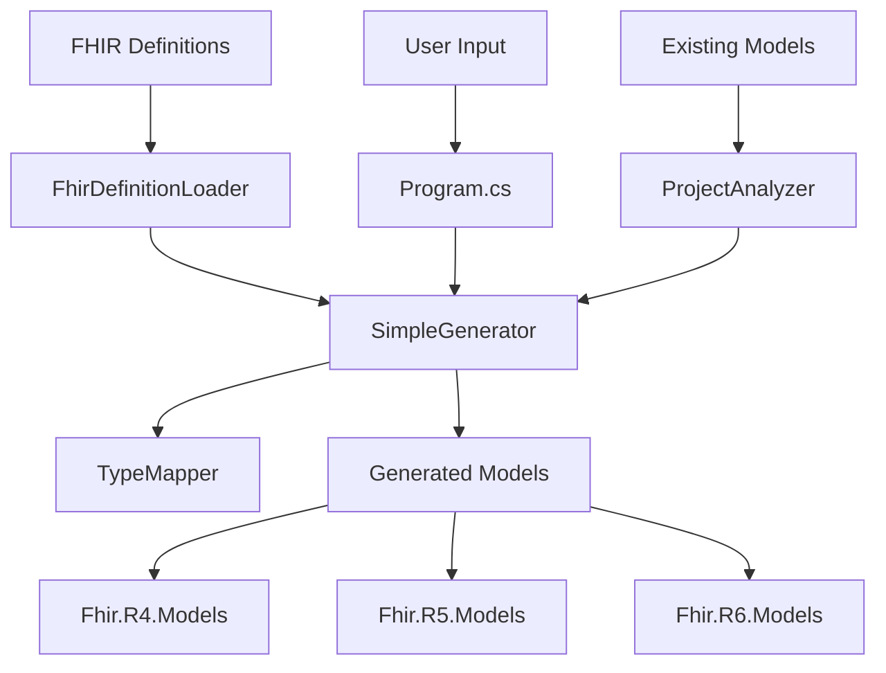

# FHIR Generator 架構設計

> **📚 此文件已移至 [docs/Generator/Architecture.md](../docs/Generator/Architecture.md)**

請前往新位置查看完整的架構設計文件。

## 🏗️ **整體架構**



## 📦 **核心組件**

### **1. Program.cs**
- **職責**: 命令列介面和使用者互動
- **功能**: 
  - 解析命令列參數
  - 協調各組件執行
  - 錯誤處理和使用者回饋

### **2. SimpleGenerator**
- **職責**: 核心程式碼生成邏輯
- **功能**:
  - 生成 Resource 類別
  - 生成 Primitive Type 類別
  - 類型映射和轉換
  - 程式碼格式化

### **3. FhirDefinitionLoader**
- **職責**: 載入和解析 FHIR 定義檔
- **功能**:
  - 讀取 definitions.json.zip
  - 解析 JSON 結構
  - 轉換為內部模型

### **4. TypeMapper**
- **職責**: FHIR 類型到 C# 類型的映射
- **功能**:
  - Primitive Type 映射
  - Complex Type 映射
  - 泛型類型處理

### **5. ProjectAnalyzer** (未來功能)
- **職責**: 分析現有專案結構
- **功能**:
  - 掃描現有檔案
  - 檢測手工優化
  - 差異分析

## 🔄 **生成流程**

### **階段 1: 初始化**
```
User Input → Validate Version → Load Definitions
```

### **階段 2: 分析**
```
Existing Project? → Scan Files → Analyze Differences
```

### **階段 3: 生成**
```
Generate Resources → Generate DataTypes → Generate Base Classes
```

### **階段 4: 輸出**
```
Write Files → Protect Existing → Report Results
```

## 📋 **資料模型**

### **ResourceInfo**
```csharp
public class ResourceInfo
{
    public string ClassName { get; set; }
    public string ResourceType { get; set; }
    public string Description { get; set; }
    public List<PropertyDefinition> Properties { get; set; }
}
```

### **PropertyDefinition**
```csharp
public class PropertyDefinition
{
    public string Name { get; set; }
    public string Type { get; set; }
    public string Description { get; set; }
    public int MinCardinality { get; set; }
    public string MaxCardinality { get; set; }
    public int Order { get; set; }
}
```

### **PrimitiveTypeInfo**
```csharp
public class PrimitiveTypeInfo
{
    public string ClassName { get; set; }
    public string NativeType { get; set; }
    public string Description { get; set; }
    public string Pattern { get; set; }
}
```

## 🎯 **設計原則**

### **1. 單一職責原則**
- 每個類別只負責一個特定功能
- Generator 只生成程式碼，不處理 SDK 功能

### **2. 開放封閉原則**
- 對擴展開放：容易添加新的 FHIR 版本支援
- 對修改封閉：不需要修改現有程式碼

### **3. 依賴反轉原則**
- 依賴抽象而不是具體實作
- 使用介面定義組件間的契約

### **4. 關注點分離**
- 程式碼生成 vs SDK 功能
- 檔案操作 vs 業務邏輯
- 使用者介面 vs 核心邏輯

## 🔧 **類型映射策略**

### **FHIR Primitive Types → C# Types**
```csharp
"string" → "FhirString?"
"boolean" → "FhirBoolean?"
"integer" → "FhirInteger?"
"decimal" → "FhirDecimal?"
"date" → "FhirDate?"
"dateTime" → "FhirDateTime?"
"code" → "FhirCode?"
"uri" → "FhirUri?"
```

### **FHIR Complex Types → C# Types**
```csharp
"Identifier" → "List<Identifier>?" (if max > 1)
"Identifier" → "Identifier?" (if max = 1)
"HumanName" → "List<HumanName>?"
"Reference" → "Reference?"
```

## 📁 **檔案組織策略**

### **命名空間結構**
```
Fhir.{Version}.Models
├── Base (基礎類別)
├── Resources (FHIR Resources)
├── DataTypes
│   ├── PrimitiveTypes
│   └── ComplexTypes
```

### **檔案命名規則**
- Resource: `{ResourceName}.cs`
- Primitive Type: `Fhir{TypeName}.cs`
- Complex Type: `{TypeName}.cs`

## 🛡️ **錯誤處理策略**

### **輸入驗證**
- 驗證 FHIR 版本有效性
- 檢查定義檔存在性
- 驗證輸出路徑權限

### **生成錯誤**
- 類型映射失敗
- 檔案寫入錯誤
- 編譯驗證失敗

### **恢復機制**
- 自動備份現有檔案
- 部分失敗時的回滾
- 詳細的錯誤報告

## 🚀 **效能考量**

### **記憶體管理**
- 使用 StringBuilder 進行字串操作
- 及時釋放大型物件
- 避免不必要的物件創建

### **I/O 最佳化**
- 批次檔案操作
- 非同步 I/O 操作
- 適當的緩衝區大小

### **並行處理**
- 獨立檔案的並行生成
- 類型映射的快取機制
- 適當的工作分割

## 🔮 **未來擴展**

### **版本管理**
- 支援多版本並存
- 版本間差異分析
- 自動遷移建議

### **自訂化支援**
- 可配置的生成範本
- 自訂類型映射規則
- 插件式擴展機制

### **整合功能**
- CI/CD 整合
- IDE 插件支援
- 自動化測試生成

## 📊 **品質保證**

### **程式碼品質**
- 單元測試覆蓋率 > 80%
- 程式碼分析工具檢查
- 一致的程式碼風格

### **生成品質**
- 生成程式碼的編譯驗證
- FHIR 規範符合性檢查
- 效能基準測試

### **文件品質**
- API 文件完整性
- 使用範例的正確性
- 架構圖的時效性
