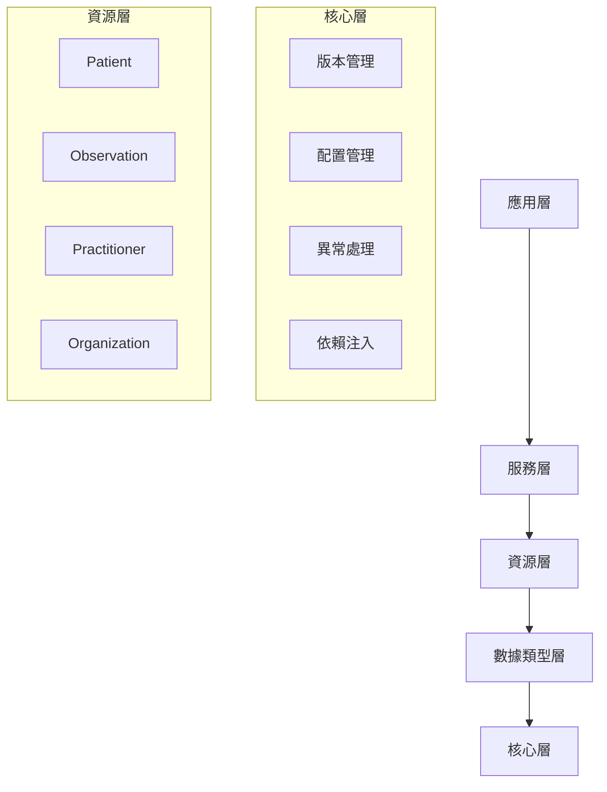

# FHIR SDK 完整使用手冊

## 目錄
1. [概述](#概述)
2. [架構深度解析](#架構深度解析)
3. [高級配置](#高級配置)
4. [資源管理](#資源管理)
5. [版本遷移](#版本遷移)
6. [性能優化](#性能優化)
7. [安全性](#安全性)
8. [擴展開發](#擴展開發)
9. [故障排除](#故障排除)
10. [最佳實踐](#最佳實踐)

---

## 概述

FHIR SDK 是一個企業級的.NET FHIR實現，專為需要高性能、可擴展和版本兼容的醫療信息系統而設計。本手冊涵蓋了所有高級功能和最佳實踐。

### 核心價值主張
- **類型安全**：強型別C#類別對應所有FHIR資源
- **版本管理**：內建R5到R6的遷移路徑
- **企業級**：支援大規模部署和高可用性
- **可擴展**：模組化設計支援自定義擴展

---

## 架構深度解析

### 分層架構



### 關鍵組件

#### 1. 版本管理系統

```csharp
// IVersionAware - 所有組件的基礎介面
public interface IVersionAware
{
    FhirVersion SupportedVersion { get; }
    bool CanHandle(FhirVersion version);
}

// 使用範例
public class PatientService : IVersionAware
{
    public FhirVersion SupportedVersion => FhirVersion.R5;
    
    public bool CanHandle(FhirVersion version)
    {
        return version == FhirVersion.R5 || 
               (version == FhirVersion.R6 && IsR6Compatible());
    }
}
```

#### 2. 資源工廠模式

```csharp
// 版本化資源創建
public interface IFhirResourceFactory : IVersionAware
{
    T Create<T>() where T : class, IFhirResource, new();
    T CreateFromJson<T>(string json) where T : class, IFhirResource;
    IFhirResource CreateByType(string resourceType);
}

// 高級使用
public class PatientManager
{
    private readonly IFhirResourceFactory _factory;
    
    public async Task<Patient> CreatePatientAsync(PatientDto dto)
    {
        var patient = _factory.Create<Patient>();
        
        // 自動版本檢查
        if (!patient.CanHandle(_currentVersion))
        {
            throw new FhirVersionNotSupportedException(_currentVersion);
        }
        
        // 映射資料
        MapDtoToResource(dto, patient);
        
        return patient;
    }
}
```

#### 3. Repository模式

```csharp
// 泛型Repository實現
public interface IFhirRepository<T> : IVersionAware where T : class, IFhirResource
{
    Task<T?> GetByIdAsync(string id, CancellationToken cancellationToken = default);
    Task<IFhirSearchResult<T>> SearchAsync(IFhirSearchParameters parameters, CancellationToken cancellationToken = default);
    Task<T> CreateAsync(T resource, CancellationToken cancellationToken = default);
    Task<T> UpdateAsync(T resource, CancellationToken cancellationToken = default);
    Task DeleteAsync(string id, CancellationToken cancellationToken = default);
}

// 實現範例
public class PatientRepository : IFhirRepository<Patient>
{
    private readonly IDbContext _context;
    private readonly IFhirResourceFactory _factory;
    
    public async Task<IFhirSearchResult<Patient>> SearchAsync(
        IFhirSearchParameters parameters, 
        CancellationToken cancellationToken = default)
    {
        var query = _context.Patients.AsQueryable();
        
        // 動態查詢建構
        foreach (var param in parameters.Parameters)
        {
            query = ApplySearchParameter(query, param.Key, param.Value);
        }
        
        // 分頁處理
        var total = await query.CountAsync(cancellationToken);
        var offset = parameters.Offset ?? 0;
        var count = parameters.Count ?? 50;
        
        var results = await query
            .Skip(offset)
            .Take(count)
            .ToListAsync(cancellationToken);
        
        return new FhirSearchResult<Patient>
        {
            Resources = results.ToArray(),
            Total = total,
            Timestamp = DateTimeOffset.UtcNow
        };
    }
}
```

---

## 高級配置

### 環境特定配置

#### 開發環境
```json
{
  "FhirSdk": {
    "DefaultVersion": "R5",
    "SupportedVersions": ["R5"],
    "EnableAutoMigration": true,
    "Validation": {
      "StrictValidation": false,
      "ValidateProfiles": false,
      "ValidateTerminology": false,
      "FailOnWarnings": false
    },
    "Performance": {
      "EnableCaching": false,
      "EnableParallelProcessing": false,
      "MaxDegreeOfParallelism": 1
    }
  },
  "Logging": {
    "LogLevel": {
      "Default": "Debug",
      "Core.Versioning": "Trace"
    }
  }
}
```

#### 生產環境
```json
{
  "FhirSdk": {
    "DefaultVersion": "R5",
    "SupportedVersions": ["R5"],
    "EnableAutoMigration": false,
    "Validation": {
      "StrictValidation": true,
      "ValidateProfiles": true,
      "ValidateTerminology": true,
      "FailOnWarnings": true
    },
    "Performance": {
      "EnableCaching": true,
      "CacheExpirationMinutes": 240,
      "MaxCacheSizeMB": 500,
      "EnableParallelProcessing": true,
      "MaxDegreeOfParallelism": 8
    }
  },
  "FhirServer": {
    "BaseUrl": "https://fhir.hospital.org/fhir",
    "TimeoutSeconds": 60,
    "MaxRetryAttempts": 5,
    "Authentication": {
      "AuthType": "OAuth2",
      "ClientId": "${FHIR_CLIENT_ID}",
      "ClientSecret": "${FHIR_CLIENT_SECRET}",
      "TokenEndpoint": "https://auth.hospital.org/oauth2/token",
      "Scopes": ["system/Patient.read", "system/Observation.write"]
    }
  }
}
```

### 程式碼配置

```csharp
// 進階服務配置
public void ConfigureServices(IServiceCollection services)
{
    // 基礎FHIR SDK配置
    services.AddFhirSdk(options =>
    {
        options.DefaultVersion = FhirVersion.R5;
        options.SupportedVersions = new[] { FhirVersion.R5, FhirVersion.R6 };
        options.EnableAutoMigration = Environment.IsDevelopment();
        
        // 自定義驗證規則
        options.Validation.StrictValidation = !Environment.IsDevelopment();
        options.Validation.ValidateProfiles = true;
        
        // 性能調優
        options.Performance.EnableCaching = true;
        options.Performance.CacheExpirationMinutes = 120;
        options.Performance.MaxCacheSizeMB = 200;
    });
    
    // Repository註冊
    services.AddVersionedRepository<Patient, PatientRepository>(FhirVersion.R5);
    services.AddVersionedRepository<Observation, ObservationRepository>(FhirVersion.R5);
    
    // 自定義服務
    services.AddScoped<IPatientService, PatientService>();
    services.AddScoped<IObservationService, ObservationService>();
    
    // 健康檢查
    services.AddHealthChecks()
        .AddCheck<FhirSdkHealthCheck>("fhir-sdk")
        .AddCheck<DatabaseHealthCheck>("database");
}
```

---

## 資源管理

### 資源生命週期管理

```csharp
public class PatientLifecycleManager
{
    private readonly IFhirRepository<Patient> _repository;
    private readonly ILogger<PatientLifecycleManager> _logger;
    private readonly IValidationService _validator;
    
    public async Task<Patient> CreatePatientAsync(CreatePatientRequest request)
    {
        // 1. 驗證輸入
        var validationResult = await _validator.ValidateAsync(request);
        if (!validationResult.IsValid)
        {
            throw new FhirValidationException("Invalid patient data", 
                JsonSerializer.Serialize(validationResult.Issues));
        }
        
        // 2. 創建資源
        var patient = new Patient
        {
            Id = Guid.NewGuid().ToString(),
            Meta = new Meta
            {
                LastUpdated = DateTimeOffset.UtcNow,
                VersionId = "1"
            }
        };
        
        // 3. 映射資料
        MapRequestToPatient(request, patient);
        
        // 4. 業務邏輯驗證
        await ValidateBusinessRules(patient);
        
        // 5. 持久化
        var savedPatient = await _repository.CreateAsync(patient);
        
        // 6. 事件發布
        await PublishPatientCreatedEvent(savedPatient);
        
        _logger.LogInformation("Patient created: {PatientId}", savedPatient.Id);
        return savedPatient;
    }
    
    public async Task<Patient> UpdatePatientAsync(string id, UpdatePatientRequest request)
    {
        // 1. 獲取現有資源
        var existingPatient = await _repository.GetByIdAsync(id);
        if (existingPatient == null)
        {
            throw new FhirResourceNotFoundException("Patient", id);
        }
        
        // 2. 樂觀鎖檢查
        if (request.IfMatch != null && existingPatient.Meta?.VersionId != request.IfMatch)
        {
            throw new FhirConflictException("Resource version mismatch");
        }
        
        // 3. 更新資源
        MapRequestToPatient(request, existingPatient);
        existingPatient.Meta.LastUpdated = DateTimeOffset.UtcNow;
        existingPatient.Meta.VersionId = (int.Parse(existingPatient.Meta.VersionId) + 1).ToString();
        
        // 4. 驗證變更
        await ValidateBusinessRules(existingPatient);
        
        // 5. 持久化
        var updatedPatient = await _repository.UpdateAsync(existingPatient);
        
        // 6. 事件發布
        await PublishPatientUpdatedEvent(updatedPatient);
        
        return updatedPatient;
    }
}
```

### 複雜查詢實現

```csharp
public class AdvancedPatientSearch
{
    private readonly IFhirRepository<Patient> _repository;
    
    // 複合查詢
    public async Task<IFhirSearchResult<Patient>> SearchPatientsAsync(PatientSearchCriteria criteria)
    {
        var searchParams = new FhirSearchParameters();
        
        // 基本查詢參數
        if (!string.IsNullOrEmpty(criteria.Name))
        {
            searchParams.Parameters["name"] = new[] { criteria.Name };
        }
        
        if (!string.IsNullOrEmpty(criteria.Identifier))
        {
            searchParams.Parameters["identifier"] = new[] { criteria.Identifier };
        }
        
        if (criteria.BirthDate.HasValue)
        {
            searchParams.Parameters["birthdate"] = new[] { criteria.BirthDate.Value.ToString("yyyy-MM-dd") };
        }
        
        // 地理位置查詢
        if (criteria.Location != null)
        {
            var locationParam = $"{criteria.Location.Latitude},{criteria.Location.Longitude}|{criteria.Location.RadiusKm}km";
            searchParams.Parameters["near"] = new[] { locationParam };
        }
        
        // 關聯資源查詢
        if (criteria.HasObservationsAfter.HasValue)
        {
            var dateParam = criteria.HasObservationsAfter.Value.ToString("yyyy-MM-dd");
            searchParams.Parameters["_has:Observation:patient:date"] = new[] { $"gt{dateParam}" };
        }
        
        // 分頁設定
        searchParams.Count = criteria.PageSize;
        searchParams.Offset = criteria.PageNumber * criteria.PageSize;
        
        return await _repository.SearchAsync(searchParams);
    }
    
    // 全文搜索
    public async Task<IFhirSearchResult<Patient>> FullTextSearchAsync(string query)
    {
        var searchParams = new FhirSearchParameters();
        searchParams.Parameters["_content"] = new[] { query };
        
        return await _repository.SearchAsync(searchParams);
    }
}
```

---

## 版本遷移

### 自定義遷移器實現

```csharp
public class CustomR5ToR6Migrator : BaseFhirMigrator
{
    public override FhirVersion FromVersion => FhirVersion.R5;
    public override FhirVersion ToVersion => FhirVersion.R6;
    
    public CustomR5ToR6Migrator(ILogger<CustomR5ToR6Migrator> logger) : base(logger) { }
    
    protected override JsonDocument MigrateInternal(JsonDocument source)
    {
        var root = source.RootElement;
        var resourceType = GetPropertyValue(root, "resourceType");
        
        return resourceType switch
        {
            "Patient" => MigratePatient(root),
            "Observation" => MigrateObservation(root),
            "Organization" => MigrateOrganization(root),
            _ => MigrateGeneric(root)
        };
    }
    
    private JsonDocument MigratePatient(JsonElement source)
    {
        using var stream = new MemoryStream();
        using var writer = new Utf8JsonWriter(stream);
        
        writer.WriteStartObject();
        
        // 複製基本屬性
        foreach (var property in source.EnumerateObject())
        {
            if (property.Name == "communication")
            {
                // R6中communication結構有變化
                MigratePatientCommunication(property.Value, writer);
            }
            else if (property.Name == "contact")
            {
                // R6中contact結構更新
                MigratePatientContact(property.Value, writer);
            }
            else
            {
                property.WriteTo(writer);
            }
        }
        
        // 添加R6新屬性
        if (!HasProperty(source, "pronouns"))
        {
            writer.WriteStartArray("pronouns");
            writer.WriteEndArray();
        }
        
        writer.WriteEndObject();
        writer.Flush();
        
        return JsonDocument.Parse(stream.ToArray());
    }
    
    private void MigratePatientCommunication(JsonElement communications, Utf8JsonWriter writer)
    {
        writer.WriteStartArray("communication");
        
        foreach (var comm in communications.EnumerateArray())
        {
            writer.WriteStartObject();
            
            foreach (var prop in comm.EnumerateObject())
            {
                if (prop.Name == "language")
                {
                    // R6中language結構變更為CodeableReference
                    writer.WriteStartObject("language");
                    writer.WriteStartObject("concept");
                    prop.Value.WriteTo(writer);
                    writer.WriteEndObject();
                    writer.WriteEndObject();
                }
                else
                {
                    prop.WriteTo(writer);
                }
            }
            
            writer.WriteEndObject();
        }
        
        writer.WriteEndArray();
    }
}
```

### 批次遷移處理

```csharp
public class BatchMigrationService
{
    private readonly FhirVersionManager _versionManager;
    private readonly ILogger<BatchMigrationService> _logger;
    
    public async Task<MigrationResult> MigrateBatchAsync(
        IEnumerable<string> resources,
        FhirVersion fromVersion,
        FhirVersion toVersion,
        BatchMigrationOptions options = null)
    {
        options ??= new BatchMigrationOptions();
        var result = new MigrationResult();
        
        var semaphore = new SemaphoreSlim(options.MaxConcurrency);
        var tasks = resources.Select(async resource =>
        {
            await semaphore.WaitAsync();
            try
            {
                var migrated = await _versionManager.MigrateAsync(resource, fromVersion, toVersion);
                result.AddSuccess(resource, migrated);
            }
            catch (Exception ex)
            {
                result.AddError(resource, ex);
                _logger.LogError(ex, "Failed to migrate resource");
            }
            finally
            {
                semaphore.Release();
            }
        });
        
        await Task.WhenAll(tasks);
        return result;
    }
}

public class MigrationResult
{
    public List<(string Original, string Migrated)> Successful { get; } = new();
    public List<(string Resource, Exception Error)> Failed { get; } = new();
    
    public int SuccessCount => Successful.Count;
    public int FailureCount => Failed.Count;
    public bool HasErrors => Failed.Any();
}
```

---

## 性能優化

### 快取策略

```csharp
public class CachedFhirRepository<T> : IFhirRepository<T> where T : class, IFhirResource
{
    private readonly IFhirRepository<T> _innerRepository;
    private readonly IMemoryCache _cache;
    private readonly IOptions<PerformanceOptions> _options;
    
    public async Task<T?> GetByIdAsync(string id, CancellationToken cancellationToken = default)
    {
        var cacheKey = $"{typeof(T).Name}:{id}";
        
        if (_cache.TryGetValue(cacheKey, out T? cached))
        {
            return cached;
        }
        
        var resource = await _innerRepository.GetByIdAsync(id, cancellationToken);
        if (resource != null)
        {
            var cacheOptions = new MemoryCacheEntryOptions
            {
                AbsoluteExpirationRelativeToNow = TimeSpan.FromMinutes(_options.Value.CacheExpirationMinutes),
                SlidingExpiration = TimeSpan.FromMinutes(_options.Value.CacheExpirationMinutes / 2),
                Size = EstimateSize(resource)
            };
            
            _cache.Set(cacheKey, resource, cacheOptions);
        }
        
        return resource;
    }
    
    private long EstimateSize(T resource)
    {
        // 簡單的大小估算
        var json = resource.ToJson();
        return Encoding.UTF8.GetByteCount(json);
    }
}
```

### 連接池管理

```csharp
public class ConnectionPoolManager
{
    private readonly IServiceProvider _serviceProvider;
    private readonly IOptions<FhirServerOptions> _options;
    private readonly SemaphoreSlim _connectionSemaphore;
    
    public ConnectionPoolManager(IServiceProvider serviceProvider, IOptions<FhirServerOptions> options)
    {
        _serviceProvider = serviceProvider;
        _options = options;
        _connectionSemaphore = new SemaphoreSlim(_options.Value.MaxConnections, _options.Value.MaxConnections);
    }
    
    public async Task<TResult> ExecuteWithConnectionAsync<TResult>(
        Func<IFhirClient, Task<TResult>> operation,
        CancellationToken cancellationToken = default)
    {
        await _connectionSemaphore.WaitAsync(cancellationToken);
        try
        {
            using var scope = _serviceProvider.CreateScope();
            var client = scope.ServiceProvider.GetRequiredService<IFhirClient>();
            
            return await operation(client);
        }
        finally
        {
            _connectionSemaphore.Release();
        }
    }
}
```

### 並行處理

```csharp
public class ParallelResourceProcessor
{
    private readonly IOptions<PerformanceOptions> _options;
    
    public async Task<ProcessingResult<T>> ProcessResourcesAsync<T>(
        IEnumerable<T> resources,
        Func<T, Task<ProcessingResult<T>>> processor,
        CancellationToken cancellationToken = default) where T : IFhirResource
    {
        var parallelOptions = new ParallelOptions
        {
            MaxDegreeOfParallelism = _options.Value.EnableParallelProcessing 
                ? _options.Value.MaxDegreeOfParallelism 
                : 1,
            CancellationToken = cancellationToken
        };
        
        var results = new ConcurrentBag<ProcessingResult<T>>();
        
        await Parallel.ForEachAsync(resources, parallelOptions, async (resource, ct) =>
        {
            try
            {
                var result = await processor(resource);
                results.Add(result);
            }
            catch (Exception ex)
            {
                results.Add(ProcessingResult<T>.Error(resource, ex));
            }
        });
        
        return ProcessingResult<T>.Aggregate(results);
    }
}
```

---

## 安全性

### SMART on FHIR實現

```csharp
public class SmartOnFhirAuthenticationHandler : AuthenticationHandler<SmartOnFhirOptions>
{
    public SmartOnFhirAuthenticationHandler(
        IOptionsMonitor<SmartOnFhirOptions> options,
        ILoggerFactory logger,
        UrlEncoder encoder,
        ISystemClock clock) : base(options, logger, encoder, clock)
    {
    }
    
    protected override async Task<AuthenticateResult> HandleAuthenticateAsync()
    {
        if (!Request.Headers.ContainsKey("Authorization"))
        {
            return AuthenticateResult.NoResult();
        }
        
        var authHeader = Request.Headers["Authorization"].ToString();
        if (!authHeader.StartsWith("Bearer "))
        {
            return AuthenticateResult.Fail("Invalid authorization header");
        }
        
        var token = authHeader.Substring("Bearer ".Length);
        
        try
        {
            var validationResult = await ValidateTokenAsync(token);
            if (!validationResult.IsValid)
            {
                return AuthenticateResult.Fail("Invalid token");
            }
            
            var claims = ExtractClaims(validationResult.Principal);
            var identity = new ClaimsIdentity(claims, Scheme.Name);
            var principal = new ClaimsPrincipal(identity);
            
            return AuthenticateResult.Success(new AuthenticationTicket(principal, Scheme.Name));
        }
        catch (Exception ex)
        {
            Logger.LogError(ex, "Token validation failed");
            return AuthenticateResult.Fail("Token validation failed");
        }
    }
    
    private async Task<TokenValidationResult> ValidateTokenAsync(string token)
    {
        // JWT驗證邏輯
        var tokenHandler = new JwtSecurityTokenHandler();
        var validationParameters = new TokenValidationParameters
        {
            ValidateIssuer = true,
            ValidIssuer = Options.Issuer,
            ValidateAudience = true,
            ValidAudience = Options.Audience,
            ValidateLifetime = true,
            IssuerSigningKey = Options.SigningKey,
            ClockSkew = TimeSpan.FromMinutes(5)
        };
        
        var result = await tokenHandler.ValidateTokenAsync(token, validationParameters);
        return new TokenValidationResult { IsValid = result.IsValid, Principal = result.ClaimsIdentity };
    }
}
```

### 審計日誌

```csharp
public class FhirAuditService : IFhirAuditService
{
    private readonly IAuditRepository _repository;
    private readonly ILogger<FhirAuditService> _logger;
    
    public async Task LogResourceAccessAsync(ResourceAccessAuditEvent auditEvent)
    {
        var audit = new AuditEvent
        {
            Id = Guid.NewGuid().ToString(),
            Type = new Coding("http://terminology.hl7.org/CodeSystem/audit-event-type", "rest"),
            Action = MapActionToCode(auditEvent.Action),
            Recorded = DateTimeOffset.UtcNow,
            Outcome = auditEvent.Success ? AuditEventOutcome.Success : AuditEventOutcome.MinorFailure,
            Agent = new[]
            {
                new AuditEventAgent
                {
                    Who = new Reference($"User/{auditEvent.UserId}"),
                    Requestor = true,
                    Type = new CodeableConcept
                    {
                        Coding = new[]
                        {
                            new Coding("http://terminology.hl7.org/CodeSystem/extra-security-role-type", "humanuser")
                        }
                    }
                }
            },
            Source = new AuditEventSource
            {
                Site = Environment.MachineName,
                Observer = new Reference($"Device/{Environment.MachineName}")
            },
            Entity = new[]
            {
                new AuditEventEntity
                {
                    What = new Reference($"{auditEvent.ResourceType}/{auditEvent.ResourceId}"),
                    Type = new Coding("http://terminology.hl7.org/CodeSystem/audit-entity-type", "2"),
                    Role = new Coding("http://terminology.hl7.org/CodeSystem/object-role", "4")
                }
            }
        };
        
        await _repository.SaveAuditEventAsync(audit);
        _logger.LogInformation("Audit event logged: {EventId}", audit.Id);
    }
}
```

---

## 擴展開發

### 自定義資源類型

```csharp
[ResourceType("CustomPatient")]
public class CustomPatient : Patient
{
    // 自定義屬性
    [Element("customField1", typeof(FhirString), true, false, false, false)]
    public FhirString CustomField1 { get; set; }
    
    [Element("customField2", typeof(CodeableConcept), false, false, false, false)]
    public CodeableConcept CustomField2 { get; set; }
    
    // 重寫驗證邏輯
    public override IValidationResult Validate()
    {
        var baseResult = base.Validate();
        var issues = new List<IValidationIssue>(baseResult.Issues);
        
        // 自定義驗證規則
        if (string.IsNullOrEmpty(CustomField1?.Value))
        {
            issues.Add(new ValidationIssue
            {
                Severity = ValidationSeverity.Error,
                Code = "required",
                Details = "CustomField1 is required",
                Location = "Patient.customField1"
            });
        }
        
        return new ValidationResult
        {
            IsValid = !issues.Any(i => i.Severity <= ValidationSeverity.Error),
            Issues = issues.ToArray(),
            FhirVersion = SupportedVersion
        };
    }
}
```

### 自定義驗證器

```csharp
public class CustomFhirValidator : IFhirValidator
{
    private readonly IStructureDefinitionService _structureDefinitionService;
    private readonly ITerminologyService _terminologyService;
    
    public async Task<IValidationResult> ValidateResourceAsync<T>(T resource) where T : IFhirResource
    {
        var issues = new List<IValidationIssue>();
        
        // 結構驗證
        await ValidateStructureAsync(resource, issues);
        
        // 術語驗證
        await ValidateTerminologyAsync(resource, issues);
        
        // 業務規則驗證
        await ValidateBusinessRulesAsync(resource, issues);
        
        return new ValidationResult
        {
            IsValid = !issues.Any(i => i.Severity <= ValidationSeverity.Error),
            Issues = issues.ToArray(),
            FhirVersion = resource.SupportedVersion
        };
    }
    
    private async Task ValidateStructureAsync<T>(T resource, List<IValidationIssue> issues) where T : IFhirResource
    {
        // 根據StructureDefinition驗證
        var profile = await _structureDefinitionService.GetProfileAsync(resource.ResourceType);
        if (profile != null)
        {
            foreach (var element in profile.Snapshot.Element)
            {
                await ValidateElementAsync(resource, element, issues);
            }
        }
    }
    
    private async Task ValidateTerminologyAsync<T>(T resource, List<IValidationIssue> issues) where T : IFhirResource
    {
        // 驗證碼值綁定
        var codeElements = ExtractCodeElements(resource);
        foreach (var codeElement in codeElements)
        {
            var isValid = await _terminologyService.ValidateCodeAsync(
                codeElement.System, 
                codeElement.Code, 
                codeElement.ValueSet);
                
            if (!isValid)
            {
                issues.Add(new ValidationIssue
                {
                    Severity = ValidationSeverity.Error,
                    Code = "code-invalid",
                    Details = $"Code {codeElement.Code} is not valid in system {codeElement.System}",
                    Location = codeElement.Path
                });
            }
        }
    }
}
```

---

## 故障排除

### 常見問題及解決方案

#### 1. 版本兼容性問題

**問題**：`FhirVersionNotSupportedException: FHIR version R6 is not supported`

**診斷**：
```csharp
public class VersionDiagnostics
{
    public static void DiagnoseVersionIssue(IServiceProvider serviceProvider)
    {
        var factory = serviceProvider.GetService<IFhirResourceFactory>();
        var versionManager = serviceProvider.GetService<FhirVersionManager>();
        
        Console.WriteLine($"Factory supports: {factory?.SupportedVersion}");
        Console.WriteLine($"Version manager supports: {versionManager?.SupportedVersion}");
        
        var options = serviceProvider.GetService<IOptions<FhirSdkOptions>>();
        Console.WriteLine($"Configured versions: {string.Join(", ", options?.Value.SupportedVersions ?? Array.Empty<FhirVersion>())}");
    }
}
```

**解決方案**：
```csharp
// 更新配置以支援R6
services.AddFhirSdk(options =>
{
    options.SupportedVersions = new[] { FhirVersion.R5, FhirVersion.R6 };
    options.DefaultVersion = FhirVersion.R6;
});
```

#### 2. 性能問題

**問題**：查詢速度慢

**診斷**：
```csharp
public class PerformanceDiagnostics
{
    public static async Task DiagnoseQueryPerformance<T>(
        IFhirRepository<T> repository,
        IFhirSearchParameters searchParams) where T : class, IFhirResource
    {
        var stopwatch = Stopwatch.StartNew();
        
        var result = await repository.SearchAsync(searchParams);
        
        stopwatch.Stop();
        
        Console.WriteLine($"Query took: {stopwatch.ElapsedMilliseconds}ms");
        Console.WriteLine($"Results: {result.Resources.Length}/{result.Total}");
        Console.WriteLine($"Memory usage: {GC.GetTotalMemory(false)} bytes");
    }
}
```

**解決方案**：
```csharp
// 啟用快取和並行處理
services.Configure<PerformanceOptions>(options =>
{
    options.EnableCaching = true;
    options.CacheExpirationMinutes = 60;
    options.EnableParallelProcessing = true;
    options.MaxDegreeOfParallelism = Environment.ProcessorCount;
});
```

#### 3. 記憶體洩漏

**診斷工具**：
```csharp
public class MemoryDiagnostics
{
    private static readonly Timer _timer = new Timer(LogMemoryUsage, null, TimeSpan.Zero, TimeSpan.FromMinutes(1));
    
    private static void LogMemoryUsage(object state)
    {
        var memoryBefore = GC.GetTotalMemory(false);
        GC.Collect();
        GC.WaitForPendingFinalizers();
        GC.Collect();
        var memoryAfter = GC.GetTotalMemory(true);
        
        Console.WriteLine($"Memory before GC: {memoryBefore:N0} bytes");
        Console.WriteLine($"Memory after GC: {memoryAfter:N0} bytes");
        Console.WriteLine($"Memory freed: {memoryBefore - memoryAfter:N0} bytes");
    }
}
```

---

## 最佳實踐

### 1. 錯誤處理策略

```csharp
public class RobustFhirService
{
    private readonly IFhirRepository<Patient> _repository;
    private readonly ILogger<RobustFhirService> _logger;
    private readonly ICircuitBreaker _circuitBreaker;
    
    public async Task<Patient> GetPatientWithRetryAsync(string id)
    {
        return await _circuitBreaker.ExecuteAsync(async () =>
        {
            var retryPolicy = Policy
                .Handle<HttpRequestException>()
                .Or<TaskCanceledException>()
                .WaitAndRetryAsync(
                    retryCount: 3,
                    sleepDurationProvider: retryAttempt => TimeSpan.FromSeconds(Math.Pow(2, retryAttempt)),
                    onRetry: (outcome, timespan, retryCount, context) =>
                    {
                        _logger.LogWarning("Retry {RetryCount} for patient {PatientId} in {TimeSpan}ms", 
                            retryCount, id, timespan.TotalMilliseconds);
                    });
            
            return await retryPolicy.ExecuteAsync(async () =>
            {
                try
                {
                    return await _repository.GetByIdAsync(id);
                }
                catch (FhirResourceNotFoundException)
                {
                    _logger.LogWarning("Patient {PatientId} not found", id);
                    return null;
                }
                catch (FhirValidationException ex)
                {
                    _logger.LogError(ex, "Validation failed for patient {PatientId}", id);
                    throw;
                }
            });
        });
    }
}
```

### 2. 測試策略

```csharp
public class PatientServiceTests
{
    private readonly Mock<IFhirRepository<Patient>> _mockRepository;
    private readonly Mock<ILogger<PatientService>> _mockLogger;
    private readonly PatientService _service;
    
    public PatientServiceTests()
    {
        _mockRepository = new Mock<IFhirRepository<Patient>>();
        _mockLogger = new Mock<ILogger<PatientService>>();
        _service = new PatientService(_mockRepository.Object, _mockLogger.Object);
    }
    
    [Fact]
    public async Task CreatePatient_ValidData_ReturnsPatient()
    {
        // Arrange
        var request = new CreatePatientRequest
        {
            FamilyName = "Test",
            GivenName = "Patient",
            BirthDate = new DateTime(1990, 1, 1)
        };
        
        var expectedPatient = new Patient { Id = "123" };
        _mockRepository.Setup(r => r.CreateAsync(It.IsAny<Patient>(), default))
                      .ReturnsAsync(expectedPatient);
        
        // Act
        var result = await _service.CreatePatientAsync(request);
        
        // Assert
        Assert.NotNull(result);
        Assert.Equal("123", result.Id);
        _mockRepository.Verify(r => r.CreateAsync(It.IsAny<Patient>(), default), Times.Once);
    }
    
    [Fact]
    public async Task CreatePatient_InvalidData_ThrowsValidationException()
    {
        // Arrange
        var request = new CreatePatientRequest(); // Invalid - missing required fields
        
        // Act & Assert
        await Assert.ThrowsAsync<FhirValidationException>(() => _service.CreatePatientAsync(request));
    }
}
```

### 3. 監控和指標

```csharp
public class FhirMetricsCollector
{
    private readonly Counter _resourceCreatedCounter;
    private readonly Histogram _operationDuration;
    private readonly Gauge _activeConnections;
    
    public FhirMetricsCollector()
    {
        _resourceCreatedCounter = Metrics.CreateCounter("fhir_resources_created_total", "Total number of FHIR resources created", new[] { "resource_type" });
        _operationDuration = Metrics.CreateHistogram("fhir_operation_duration_seconds", "Duration of FHIR operations", new[] { "operation", "resource_type" });
        _activeConnections = Metrics.CreateGauge("fhir_active_connections", "Number of active FHIR connections");
    }
    
    public void RecordResourceCreated(string resourceType)
    {
        _resourceCreatedCounter.WithLabels(resourceType).Inc();
    }
    
    public IDisposable MeasureOperation(string operation, string resourceType)
    {
        return _operationDuration.WithLabels(operation, resourceType).NewTimer();
    }
    
    public void SetActiveConnections(int count)
    {
        _activeConnections.Set(count);
    }
}
```

這份完整的使用手冊涵蓋了FHIR SDK的所有高級功能和最佳實踐，適合有經驗的FHIR開發者深入了解和使用。
